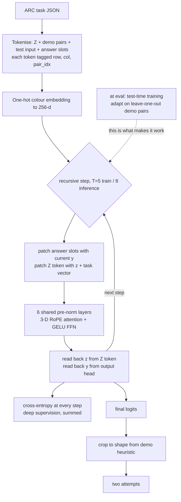

# ARC-AGI-Recursive-Transformer

[](https://www.python.org/)
[](https://pytorch.org/)
[](LICENSE)


Lightweight recursive transformer with 3-D RoPE and deep supervision for the
Abstraction and Reasoning Corpus (ARC-AGI), plus the controlled experiments that
show where its capability actually comes from.

**Best result: 2.75% exact-match on ARC-AGI-1 evaluation (400 tasks) with 4.8M
parameters.** The more useful finding is the ablation: without test-time
training the same model scores 0.25%.

> **Scope note.** The trained model and the numbers below come from
> [`DL_Assignment_Team_12.ipynb`](DL_Assignment_Team_12.ipynb), originally a
> team course assignment (CS60010). The reproduction from script, the 14-run
> experiment programme, the scoring harness and the analysis are subsequent
> individual work. The `src/` package contains that scoring harness plus a
> *separate* refactored architecture which has not been trained — it is not the
> model these results describe.

## Overview

ARC-AGI stresses few-shot abstract grid reasoning: each task provides a handful of input/output demonstrations and asks for the transformed output for a new grid. This repository refactors the original exploratory notebooks into a modular PyTorch library centered on a Tiny Recursive Transformer (TRM) style architecture.

Core innovations implemented here:

- **Dual-state recurrence:** a scratchpad state `z` performs iterative thinking while an answer state `y` is refined at each outer step.
- **Weight-tied recursive blocks:** the same z/y transformer blocks are reused across recurrent steps for parameter efficiency.
- **3D RoPE:** row, column, and pair/demo index are encoded directly inside attention.
- **Efficient transformer blocks:** `torch.nn.functional.scaled_dot_product_attention`, RMSNorm, and SwiGLU.
- **Deep supervision:** every recurrent step emits logits and contributes to exponentially weighted cross-entropy.
- **ARC-specific augmentation:** full D8 dihedral transforms, non-background color permutations, and padding-aware task tensors.
- **TTA inference:** D8 inverse-transform voting with top-2 ARC submission attempts.
- **Optional TTFT:** task-local fine-tuning utility for support-set adaptation.

## Architecture

This describes the model that produced the results — the one in
[`DL_Assignment_Team_12.ipynb`](DL_Assignment_Team_12.ipynb), 4,823,306
parameters.

A whole task becomes **one flat sequence**: a leading `[Z]` latent token, then
every demonstration pair's input and output cells, then the test input, then
placeholder slots for the answer. Each token carries a `(row, col, pair_idx)`
position triplet. Colours are embedded one-hot through a linear layer, so they
stay unordered categories rather than acquiring a spurious numeric order.

**3-D RoPE** splits each 32-dimensional attention head into 12 + 12 + 8 and
applies rotary embeddings independently over row, column and pair index — so
spatial position within a grid and membership of a particular demo pair are both
encoded directly in attention.

**Recursion** carries two states across `T` steps through one shared 6-layer
pre-norm transformer stack (bidirectional, no causal mask):

- `z` — a global latent living in the `[Z]` token
- `y` — the current answer, as per-cell colour logits

Each step re-embeds `y` into the answer slots, refreshes the `[Z]` token with
`z` plus a per-task vector, runs the stack, then reads both states back out.
`T=5` while training, `T=8` at inference — the same weights, run deeper.



The dashed edge is the finding of the whole project: without that adaptation
step the same network solves 1 evaluation task out of 400.

Output grid dimensions are **not** learned — they come from a heuristic (use the
demo output shape when all demos agree, else the test input's shape), correct on
84.25% of evaluation cases.

## Repository Structure

```text
configs/
  default_config.yaml
  t4_gpu_config.yaml
src/
  data/
    dataset.py
    augmentations.py
  models/
    layers.py
    recursive_trm.py
    shape_predictor.py
  training/
    loss.py
    scheduler.py
    trainer.py
    train.py
  inference/
    arc_score.py                ARC-protocol scoring; produced every number above
    evaluate.py
    ensemble.py
    submission.py
  utils/
    metrics.py
    visualization.py
tests/
  test_augmentations.py
  test_shapes.py
  test_inference.py
  test_training.py
  test_arc_score.py
notebooks/
  07_kaggle_all_in_one_merged.ipynb
  08_arc_agi_colab_e2e.ipynb
  archive/                      superseded exploratory notebooks
```

## Results

All figures are ARC protocol: grid-level exact match over the 400 evaluation
tasks, two attempts allowed, scored by [`src/inference/arc_score.py`](src/inference/arc_score.py).
The original notebook reports token-level accuracy, which runs slightly higher
because a prediction can match in padded token space and still be reconstructed
into a wrong-shaped grid.

| Run | Params | Exact | 95% CI | Cell acc | Paired vs baseline |
|---|---:|---:|---|---:|---|
| `tta_ttt50` **(best)** | 4.8M | **2.75%** | 1.54–4.86% | 78.31% | lost 0, gained 2 |
| `select_r3` | 4.8M | 2.25% | 1.19–4.22% | **79.56%** | p=0.688 |
| `baseline_80ep` | 4.8M | 2.25% | 1.19–4.22% | 78.07% | — |
| `ttt200_on_baseline` | 4.8M | 2.25% | 1.19–4.22% | 78.79% | p=1.000 |
| `full_sysloo_noTE_ttt50` | 4.8M | 2.00% | 1.02–3.90% | 78.14% | p=1.000 |
| `no_taskemb_80ep` | 4.8M | 1.75% | 0.85–3.57% | 78.13% | p=0.688 |
| `full_sysloo_ttt50` | 4.8M | 1.50% | 0.69–3.23% | 78.08% | p=0.453 |
| `lora_r8_ttt200` | 4.8M | 1.25% | 0.54–2.89% | 77.65% | p=0.219 |
| `lora_r8_ttt50` | 4.8M | 0.75% | 0.26–2.18% | 75.85% | p=0.070 |
| `wider_d384_80ep` | 10.8M | 0.75% | 0.26–2.18% | 76.40% | p=0.070 |
| `deeper_12L_80ep` | 9.5M | 0.75% | — | — | — |
| `no_ttt_identity` | 4.8M | 0.25% | 0.04–1.40% | 71.94% | **p=0.021** |
| *copy the input unchanged* | 0 | 0% | — | *77.88%* | *trivial baseline* |
| *predict all background* | 0 | 0% | — | *49.40%* | *trivial baseline* |

The last two rows are why the cell-accuracy column must never be read on its
own: **copying the input unchanged scores 77.88%**, because ARC grids are mostly
background and many outputs resemble their input. On the 275 cases where both
are defined the model scores **83.51% against copy-input's 77.88%** — a real
but modest +5.62pp, winning on 164 cases, tying 29 and losing 82.

Cell accuracy earns its place for resolution, not for headline value: at a 2.5%
exact-match rate it is the only signal fine-grained enough to distinguish runs
(it is what shows LoRA genuinely degrades the model by 2.2pp while systematic
leave-one-out leaves it flat). Exact match remains the benchmark.

## What the experiments showed

**Test-time training is the mechanism.** Strip per-task adaptation and the model
solves 1 evaluation task out of 400. Add 50 TTT steps and it solves 9
(McNemar p=0.021) — the only statistically significant comparison across 14 runs.
The trained network is close to inert on unseen tasks by itself, which is why
every architectural change below was invisible: they modify a component that
barely participates at evaluation time.

**ARC's second attempt was being wasted.** `predict(attempt=2)` sampled every
cell independently from the top 3; across ~100 cells at least one is
near-certain to go wrong. Measured, it solved *zero* tasks that attempt 1 missed.
Anchoring attempt 1 to the identity prediction and spending attempt 2 on the
best-supported dihedral view gained 2 tasks with zero regressions.

**The model is not symmetry-consistent.** Presented with the 8 dihedral
symmetries of the same task it agrees only 1.47 times out of 8, despite being
trained on all 8 augmentations. Test-time training raises this to 1.91/8, which
is why augmentation voting helps after adaptation and actively hurts before it.

**Capacity is the wrong lever.** A 10.8M-parameter wide variant and a 9.5M deep
variant both scored 0.75% against the 4.8M baseline's 2.25%; paired, the wide
model lost 7 tasks and gained 1. The unused 45M of the parameter budget is not
an opportunity.

**Demo-grounded candidate selection raised cell accuracy but not exact match.**
Generating candidates from 3 TTT restarts x 8 dihedral views and weighting the
vote by how well each adapted model reproduced held-out demo outputs gave the
best cell accuracy of any run (79.56%) and slightly *worse* exact match (2.25%
vs 2.75%). The selector was scored on demo *cell* accuracy, which rewards being
broadly plausible; exact match needs a candidate right on every cell. The signal
correlates with the wrong target — scoring restarts by demo exact-match rate
instead is the obvious next attempt.

**Things that made no difference**, each measured rather than assumed: removing
the per-task embedding, systematic leave-one-out instead of random sampling,
learning a task vector at adaptation time, and quadrupling TTT steps (which
churns — 4 tasks lost, 4 gained, p=1.000). LoRA adaptation was actively worse:
at 4.8M parameters full fine-tuning is cheap and strictly more expressive.

### Where the failures are

Breakdown of the best run over 419 evaluation test cases:

| Outcome | Cases | Share |
|---|---:|---:|
| Right shape, 70–90% of cells correct | 158 | 37.7% |
| Right shape, >90% correct | 103 | 24.6% |
| Wrong output shape (heuristic) | 66 | 15.8% |
| Right shape, 50–70% correct | 41 | 9.8% |
| Not close (<50%) | 34 | 8.1% |
| **Solved** | 14 | 3.3% |
| Right shape, 1–2 cells wrong | 3 | 0.7% |

Only 8% of failures are genuinely far off; a quarter are more than 90% correct
and three are within two cells. The model is nearly right constantly, and ARC
scores all-or-nothing.

### Measurement notes

At a 2.5% base rate over 400 tasks, the smallest difference detectable at 80%
power is roughly +3.5pp. Comparisons of independent runs below that are
meaningless, so runs sharing a checkpoint are compared with paired McNemar
tests, and cell accuracy is used as the higher-resolution signal. The output
shape heuristic is correct on 84.25% of cases, which caps exact match at 84.25%
regardless of the model — not currently binding at 2.75%.

## Reproducing

```bash
python src/inference/arc_score.py runs/<run_dir> [more runs...] \
    --truth path/to/ARC-AGI/data/evaluation
```

Cluster setup, node inventory and operational gotchas are in
[CLUSTER_ACCESS.md](CLUSTER_ACCESS.md).

## Installation

```bash
python3 -m venv .venv
source .venv/bin/activate
pip install -r requirements.txt
pip install -e .
```

Download ARC-AGI:

```bash
mkdir -p data
git clone https://github.com/fchollet/ARC-AGI.git data/ARC-AGI
```

## Quickstart

Score an existing run against the ARC protocol:

```bash
python src/inference/arc_score.py runs/<run_dir> [more runs...] \
    --truth path/to/ARC-AGI/data/evaluation
```

This prints exact match with Wilson intervals, case- and cell-level accuracy,
and paired McNemar tests of every later run against the first. Each run
directory needs an `eval_predictions.json` in ARC submission format
(`{task_id: [{"attempt_1": grid, "attempt_2": grid}, ...]}`).

Run the tests:

```bash
python -m venv .venv && source .venv/bin/activate
pip install -e ".[dev]"
pytest -q          # 19 tests
```

Reproduce the trained model by running
[`DL_Assignment_Team_12.ipynb`](DL_Assignment_Team_12.ipynb) end to end — about
3 hours on a contended L40S at 80 epochs, plus roughly 30 minutes for the
test-time-training evaluation pass over 400 tasks. Replace the two
`/kaggle/working` paths with local ones first, and swap the explicit attention
for `F.scaled_dot_product_attention` unless you have ~24GB of VRAM free
(identical maths, 7× less memory).

> The `src/` package below is a **separate refactor** with a different
> architecture (RMSNorm/SwiGLU, split z/y blocks, a learned shape head). It is
> tested but has never been trained, and it is not the model these results
> describe. `src/inference/arc_score.py` is the exception — that scorer produced
> every number in this README.

## Kaggle / Colab Notes

- Use `configs/t4_gpu_config.yaml` for Kaggle T4 runs.
- Keep ARC data under `/kaggle/working/ARC-AGI` or mount it as `data/ARC-AGI`.
- Mixed precision is enabled by default in `ARCTrainer`.
- Reduce `color_permutations`, `outer_steps`, or `dim` first if memory is tight.

## GitHub Metadata

- **Title:** `ARC-AGI-Recursive-Transformer`
- **About:** High-performance PyTorch implementation of a Tiny Recursive Transformer (< 50M params) solving ARC-AGI reasoning tasks via 3D-RoPE, dual-state z/y latent recurrence, massive D8 + color augmentations, and Test-Time Augmentation.
- **Topics:** `arc-agi`, `transformer`, `deep-learning`, `pytorch`, `artificial-general-intelligence`, `recursive-neural-networks`, `kaggle`, `representation-learning`, `few-shot-learning`

## Development

```bash
python3 -m venv .venv
source .venv/bin/activate
pip install -e ".[dev]"
pytest -q          # 19 tests: augmentations, shapes, inference, training, scoring
ruff check src tests
```

CPU-only PyTorch is enough for the test suite and for CLI smoke runs:

```bash
pip install --index-url https://download.pytorch.org/whl/cpu torch
```

## References

- Francois Chollet, *On the Measure of Intelligence*, 2019.
- ARC-AGI dataset: https://github.com/fchollet/ARC-AGI
- Rotary Position Embedding: https://arxiv.org/abs/2104.09864
- SwiGLU / gated feed-forward networks: https://arxiv.org/abs/2002.05202
- PyTorch scaled dot-product attention: https://pytorch.org/docs/stable/generated/torch.nn.functional.scaled_dot_product_attention.html

## License

MIT. See [LICENSE](LICENSE).
